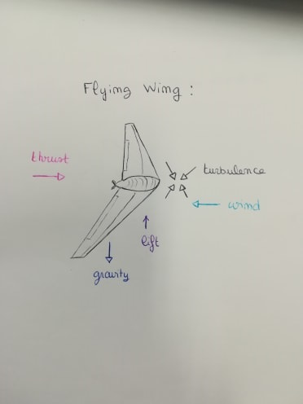

# SmartWing_ADSA

The project consists in developing the code of a smart Wing.  

## Flight path :

* acceleration
* rotation
* ascent
* put in landing
* stabilisation
* put in position
* circular flight around coordinates of take-off
* put in position
* descent
* approach/transition
* rounding
* touch down

## Objectives / goals

We are interested in the phase of acceleration, descent and circular flight around coordinates of take-off.
The idea of this project is to code trajectories and to extract an image of the trajectory and a text file with the commands to be transmitted to the wing.

